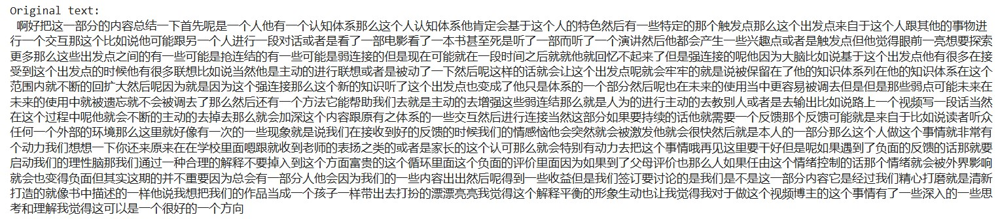
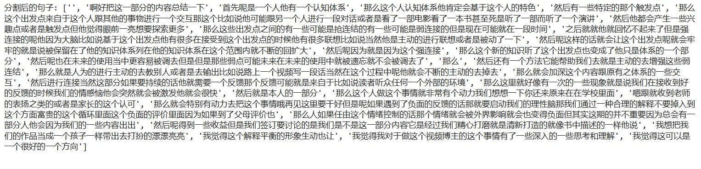
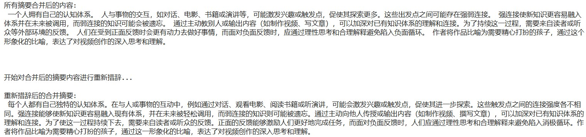

# Interesting_Tool

### The first tool achieves the function of transferring the voice to text.

- The first tool helps to record the voice. it is available that there are other recording files.
using tool: VOICE_TO_TEXT_v3_savetxt_juhao.html
(output: Original_text.txt)
   
  
Figure 1 Voice recording to text directly

- The second tool helps to extract the word, converting voice to text

   
Figure 2 Original text extracted from the recording file

- Also, since the text file extracted from the recording video does not contain any commas. So, we added the commas based on some important words.
   
   
Figure 3 Add commas to divide sentences based on keywords

- In the same tool, applying the OPENAI API, we summarize and rephrase the whole paragraph.
using tool: M4P.ipynb
(output: optimized_text.txt)

   
Figure 4 Output after using rephrase based on OPENAI API
